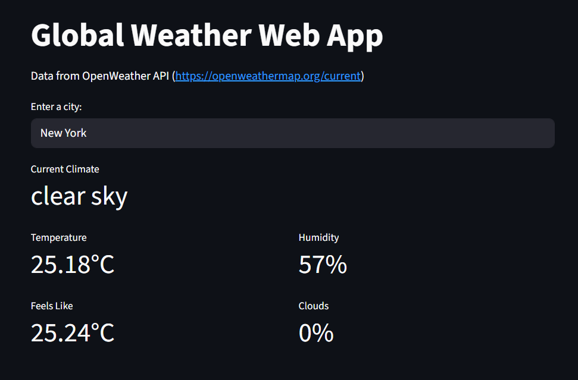

# 🌦️ OpenWeather Web App

A simple web application that displays the current weather for a given city using the OpenWeather API.

## 🖼️ Live Demo



## ✨ Features

*   Get the current weather for any city in the world. 🌍
*   Displays temperature, feels like temperature, humidity, and cloudiness. 🌡️
*   Simple and intuitive user interface. 👨‍💻

## 🚀 How to Run

1.  **Clone the repository:**
    ```bash
    git clone https://github.com/marcosnunes0/global-weather-web-app
    ```
2.  **Install the dependencies:**
    ```bash
    pip install -r requirements.txt
    ```
3.  **Set up the environment variables:**
    *   Create a `.env` file in the root of the project.
    *   Add the following line to the `.env` file:
        ```
        OPENWEATHER_API_KEY=your_api_key
        ```
    *   Replace `your_api_key` with your actual OpenWeather API key. 🔑
4.  **Run the application:**
    ```bash
    streamlit run src/app.py
    ```

## 📁 Project Structure

```
OpenWeather-Web-App/
├── assets/
├── src/
│   ├── api/
│   │   └── openweather.py
│   └── app.py
├── .env
├── requirements.txt
└── README.md
```

*   `assets/`: Contains static assets for the application. 🖼️
*   `src/api/openweather.py`: Contains the logic for making requests to the OpenWeather API. ☁️
*   `src/app.py`: The main application file (Streamlit). 👨‍💻
*   `.env`: Contains the environment variables for the application. 🔑
*   `requirements.txt`: A list of the Python dependencies for the project. 🐍
*   `README.md`: This file. 📄

## 🔗 API Integration

This application uses the [OpenWeather API](https://openweathermap.org/current) to get the current weather data for a given city. The `get_climate_for_location` function in `src/api/openweather.py` is responsible for making the API requests.

## 📦 Dependencies

The main dependencies of the project are:

*   [Streamlit](https://streamlit.io/): The web application framework.
*   [Requests](https://requests.readthedocs.io/en/latest/): For making HTTP requests to the OpenWeather API.
*   [python-dotenv](https://pypi.org/project/python-dotenv/): For managing environment variables.

For a complete list of dependencies, see the `requirements.txt` file.

## 📝 License

This project is licensed under the MIT License. See the `LICENSE` file for more details.